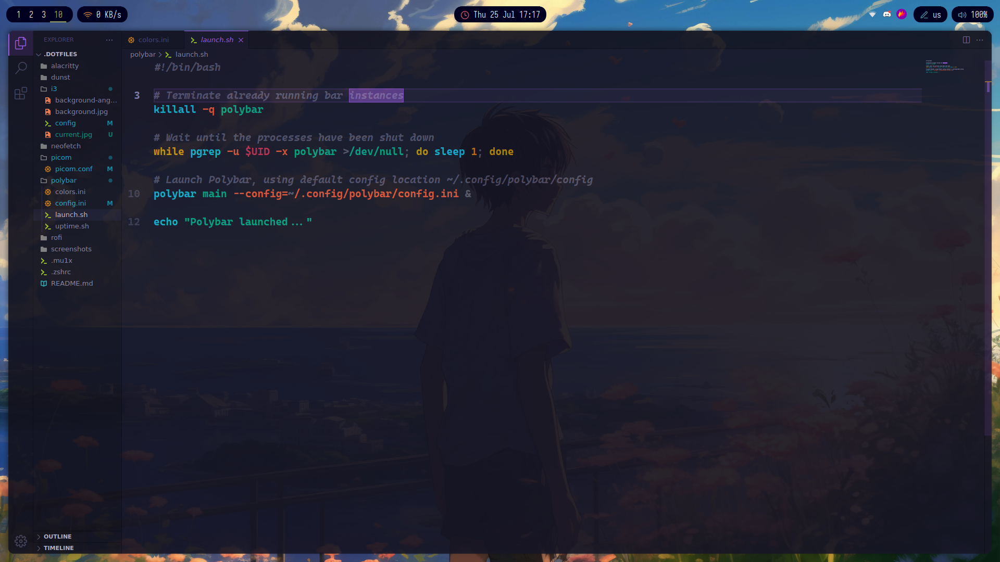

# Screenshots


# Requirements

-   [rofi](https://github.com/davatorium/rofi)
-   [alacritty](https://github.com/alacritty/alacritty)
-   [dunst](https://github.com/dunst-project/dunst)
-   [picom](https://github.com/yshui/picom)
-   [polybar](https://github.com/polybar/polybar)

# ZSH

-   [Zsh](https://www.zsh.org/)
-   [colorls](https://github.com/athityakumar/colorls) `for making fancy ls commands in .mu1x file`
-   [zoxide](https://github.com/ajeetdsouza/zoxide) `sudo pacman -S zoxide`
-   [fzf](https://github.com/junegunn/fzf) `sudo pacman -S fzf`

in `.zshrc` file, you should install [zsh-autosuggestions](https://github.com/zsh-users/zsh-autosuggestions)
or install it using this command

```
git clone https://github.com/zsh-users/zsh-autosuggestions ~/.zsh/zsh-autosuggestions
```

# VSCodium Extensions



-   [Bearded Theme](https://marketplace.visualstudio.com/items?itemName=BeardedBear.beardedtheme)
-   [Bearded Icons](https://marketplace.visualstudio.com/items?itemName=BeardedBear.beardedicons)

i'm using a lot of extensions you can use whatever you want it is up to you.
